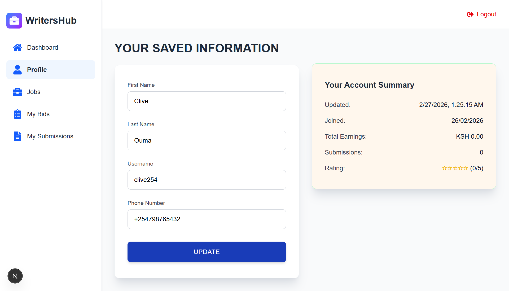
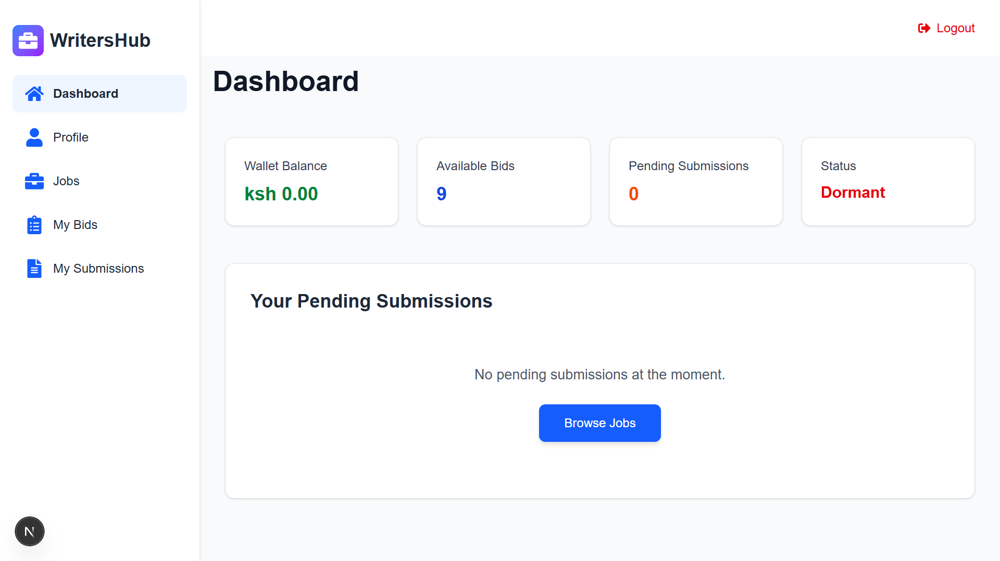
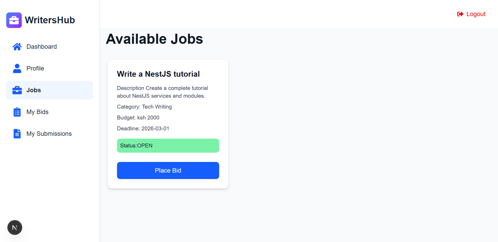
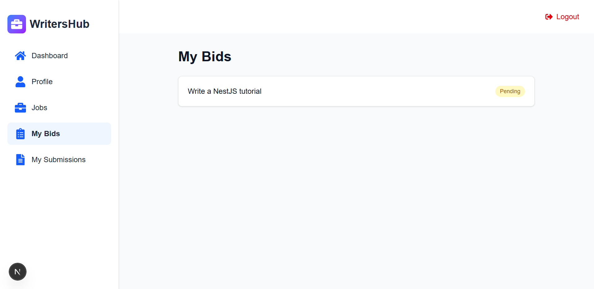

# Freelance-Marketplace

  A web platform that connects freelancers with clients.
   
  Built with <strong>Next.js</strong> and <strong>Tailwind CSS</strong> for the frontend
  and <strong>NestJS</strong> for the backend.

---

## Application Screenshots

---

### Profile Page

  

---

### Dashboard

  

---

### Available Jobs

  

---

### Bids Page

  

